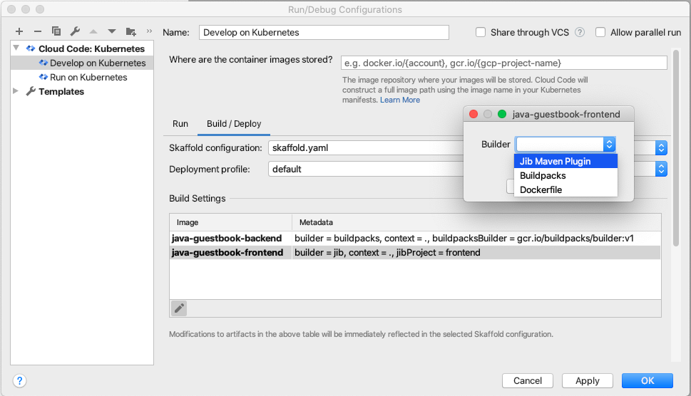
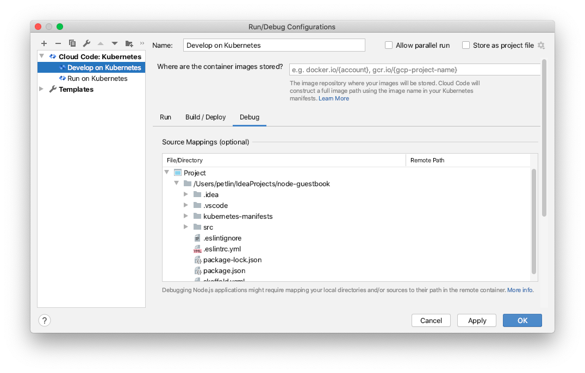
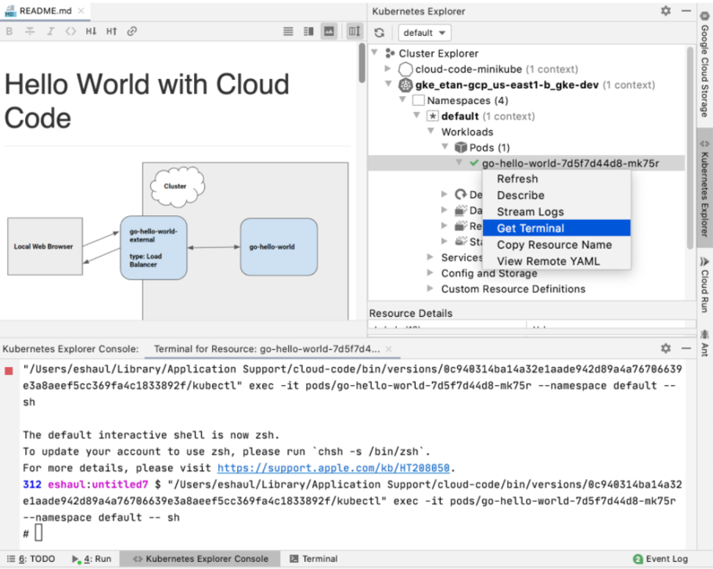
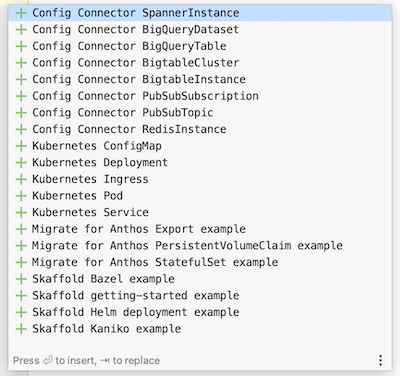
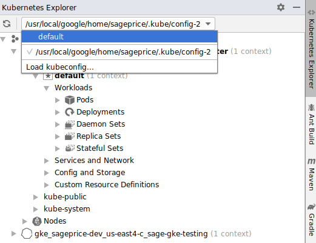
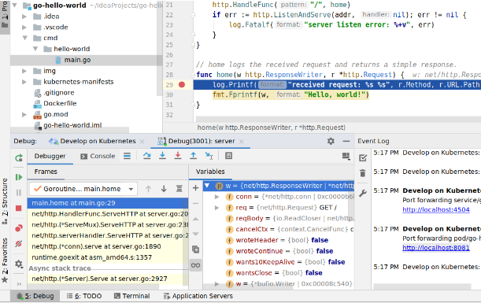
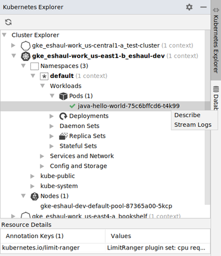
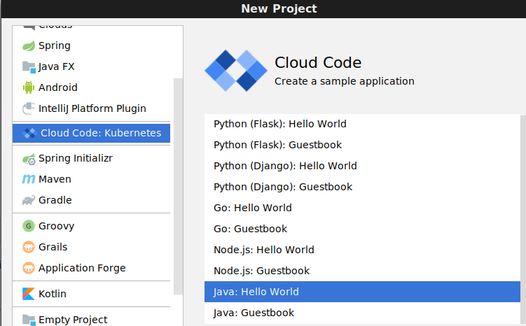

# Release notes
This page documents production updates to Cloud Code for IntelliJ. You can check this page for announcements about new or updated features, bug fixes, known issues, and deprecated functionality.

## Version 20.7.1 - Current Release

**Note:** The minimum supported platform version has been increased to 2019.3. Support for the latest EAP 2020.2 will be released separately, as soon as possible.

### New Features

- Develop and debug your Cloud Run application locally with the new `Cloud Run: Run Locally` run configuration. In addition to deploying your applications to Cloud Run, you can now iterate on the applications locally in a Cloud-Run-like environment.
\
  
\

- Build your Kubernetes and Cloud Run container images with Cloud Native Buildpacks for easy containerization with no Dockerfile required!
\
  
- Enhanced Skaffold artifact builder configurability when bootstrapping projects or modifying Kubernetes run configuration settings. Easily select between available builders such as Jib (for Java projects), Docker, or buildpacks.
\
  
- More robust debugging of Node.js applications with the ability to configure the mapping between the local path of your sources to their remote path in the container.
\
  
- Expanded to support validation, hover documentation, and code completions for hundreds of popular Kubernetes Custom Resources.
\
  

### Updates

- Improved UI for deployment to Cloud Run for Anthos, and better messaging for exposing deployed services. Cluster field will now auto-populate with all available options.
- Improved error messages throughout the plugin with clearer wording and more actionable suggestions.

### Fixes

- Fixed various binary forward compatibility issues throughout the plugin by building with the minimum supported version of the plugin.

## 20.6.1

**Note to 2020.2 EAP users**: we previously released version 20.5.1 with support for the latest EAP. We have since uncovered some compatibility issues that need to be worked through for an optimal experience, and are therefore removing support for the EAP in this release. Expect a new release as soon as possible supporting the 2020.2 EAP.

### Fixes

- Fixed an OOM error coming from the Kubernetes Explorer.
- Fixed a NoSuchFileException that occurred when using the Kubernetes explorer with no ‘.kube’ folder.
- Fixed a NoSuchMethodError coming from the Skaffold notification.
 
## 20.5.1

**Note**: In the next release we plan to bump the minimum supported platform version to 2019.3. If you are on 2019.2, we recommend that you upgrade so that you will continue to get Cloud Code updates.

### New Features

- You can now grab an interactive terminal into pods and containers from the Kubernetes Explorer. This feature is available for IDE versions 2019.3 and later.
\
  
- The Kubernetes Explorer now maintains its state through refreshes so that you don’t lose your location in the tree.
- The Kubernetes Explorer now automatically updates its state on changes so that you are immediately aware of changes to your cluster without having to manually refresh.

### Updates 

- Hovering over a Pod in Kubernetes Explorer will display more information from the Conditions Array of the Pod Status.

### Fixes 

- Fixed an `IllegalStateException: Duplicate Key` error with App Engine causing some Gradle projects to not properly import.

## 20.4.3

### Fixes

- Fixes cases where Cloud Code run configurations are not automatically created in non-IDEA JetBrains IDEs (PyCharm, GoLand, WebStorm)
- Fixes cases where Kubernetes run configurations’ state in non-IDEA JetBrains IDEs cannot be stored

## 20.4.2

This is a patch release following the 20.4.1 release adding Cloud Run support earlier this week.

### Fixes

- Fix for NoClassDefFoundError loading JavaSdk class mainly in PyCharm IDEs
- Fix for NoClassDefFoundError loading GradleSettings class

## 20.4.1

We are pleased to announce [Cloud Run](https://cloud.google.com/run) support in Cloud Code for IntelliJ!

Cloud Code now makes it easy to deploy your services to Cloud Run fully managed or Cloud Run for Anthos on GKE. You can view your deployed services right in the IDE with the Cloud Run Explorer.

Follow the [Cloud Run quickstart guide](https://cloud.google.com/code/docs/intellij/quickstart-cloud-run), and use our built-in templates to get started quickly. Please file any feature requests or issues you encounter on our [GitHub repo](https://github.com/GoogleCloudPlatform/cloud-code-intellij/issues/new)!

### New Features

- **Cloud Run** support in IntelliJ and JetBrains IDEs
  - **Cloud Run starter templates** in Java, Node.js, Go, and Python to help you get started quickly
  - **Deploy your Cloud Run services** directly from the IDE to Cloud Run fully managed or Cloud Run for Anthos on GKE
  - **Browse your deployed Cloud Run services** without leaving the IDE with the built-in Cloud Run Explorer
- Configure the log verbosity setting for the Skaffold output in the Kubernetes Run Configurations

### Updates 

- Improved UI for setting the default image repository in the Kubernetes Run Configurations 
- Improved proxy support - the Kubernetes Explorer now respects configured IntelliJ proxy settings

## 20.2.1

### New Features

- **Enhanced Client Library Browser**. Now with a much improved UI, and support for more languages including Java, Python, Node.js, and Go! View available Google Cloud APIs, enable an API, view API status (enabled or disabled), and install client libraries to consume an API, all from within your IDE. Access via Tools > Cloud Code > Add Cloud Libraries and Manage Cloud APIs  
\
  
- **Revamped Image Path UX**. For Kubernetes projects, Cloud Code now ships with a significantly improved user experience for setting the image path (e.g. `gcr.io/{gcp-project-name}`). The field will even help suggest a path for you, if possible, based on your current active context.
\
  
- **Automatically created Kubernetes Run Configurations**. When cloning a Cloud Code Kubernetes sample project from the new project wizard, the Kubernetes run configurations are now automatically created, instead of requiring a click on a notification.

### Bug Fixes
- **Kubernetes Project Detection**. Fixed an issue with the Kubernetes project detection notification where accepting the prompt to create the run configurations didn’t do anything.
- **2020.1 EAP**. Incremental fixes to support the latest 2020.1 EAP including a frequent runtime error: `window with id="Google Cloud Storage" isn't registered`. 
- Fixed a language client IllegalStateException: `java.lang.IllegalStateException: completionItem.insertText must not be null`.

## 20.1.3

Patch release following the 20.1.2 release of Cloud Code.

### Bug Fixes

- Fix backwards compatibility bug in the Kubernetes template wizard causing the missing language plugin warning to throw runtime errors in IntelliJ 2019.1
- Fix backwards compatibility bug in the Kubernetes template wizard causing the project name suggestion logic to throw runtime errors in IntelliJ 2019.2 and lower by rolling back the change

## 20.1.2

### New Features

- Easily view the YAML of a resource in your Kubernetes cluster right from the Kubernetes Explorer. Just navigate to a resource in the Kubernetes Explorer, such as a Pod, right click and select “View Remote YAML” 
\
  
- You can now re-open the welcome screen to view release notes and plugin details. Select: Tools > Cloud Code > Open Welcome Screen
- The plugin now works in the latest 2020 EAP version of IntelliJ (and other Jetbrains IDEs)
- You can now view the versions of the plugin-managed dependencies (including Skaffold and Kubectl) from the settings under Settings > Cloud Code > Kubernetes

### Updates

- The Kubernetes sample project wizard now suggests an appropriate project title instead of `untitled*` 
- The Kubernetes samples project wizard will now suggest that you install the language plugin corresponding to the selected template if it is not already installed

## 20.1.1

### New Features

- Adds a new Cloud Code Kubernetes setting to toggle the Kubernetes editing features on or off for compatibility with other plugins that provide overlapping support. Accessible under “Settings > Cloud Code > Kubernetes”.

### Bug Fixes

- Fixes `NoSuchMethodError at KubernetesSettingsConfigurable.disposeUiResources` caused by incorrect coroutine `cancel` invocation.
- Fixes possible UI thread freezes by using a more lightweight approach for detecting Skaffold configuration files.

## 19.12.1

This release improves stability and support for the recently released version 2019.3 of IntelliJ and JetBrains family of IDEs.

### Bug Fixes

- Fixes intermittent errors loading Kubernetes samples from Cloud Code’s New Project wizard.
- Fix for `It's prohibited to access index during event dispatching` exception that occurs occasionally when cloning a Kubernetes sample.
- Catches IndexOutOfBounds exception in Cloud Code’s editing support when trying to convert an LSP position to an out of bounds document offset in the IDE.

## 19.11.3

We are pleased to announce that Cloud Code is now GA!

### Bug Fixes

- Updating Skaffold version provided by the dependency manager to 1.0.1 to fix issue with the cloudbuild profile using the sample projects.

## 19.11.2

This release fixes several bugs and improves stability of the Cloud Code plugin. It also contains the GA version of Skaffold, and enhancements to YAML editing support.

### New Features

- **Skaffold is now GA.** Skaffold, the Kubernetes development CLI tool that powers several features of Cloud Code, [is now generally available](https://cloud.google.com/blog/products/application-development/kubernetes-development-simplified-skaffold-is-now-ga). Cloud Code’s automatic dependency manager now includes the GA version of Skaffold.
- **Snippets for more types of configuration files.** Cloud Code can now assist you with editing your Config Connector and Cloud Build configuration files:
\
  

### Bug Fixes

- Updated GCP login to use the new endpoint URL.

## 19.11.1

Note: This release updates the Kubernetes Run Configurations with new names and improved setting controls. Depending on your version of IntelliJ, you may be prompted to have your existing Cloud Code run configurations automatically converted to the new format. **Important: if you are running IntelliJ version 2019.2 through 2019.2.2, then you will likely have to update your IDE to the latest version to open existing Cloud Code projects (see a [IDEA-218071](https://youtrack.jetbrains.com/issue/IDEA-218071)) from the welcome screen.**

### New Features

- **Add alternate kubeconfig files.** If your workflow includes additional kubeconfig files, you can now select them for use in the Cloud Code plugin. They will then be recognized for deployment and cluster browsing:
\
  
- **Configure Migrate for Anthos easily.** Cloud Code can assist you with editing your Migrate for Anthos configuration files:
\
  
- **Add Kubernetes support for your Jib Java projects.** With one click, the “Add Kubernetes Support” menu action can quickly add Cloud Code Kubernetes support for your projects that use Jib to build container images.
- **Browse your CRDs.** The Kubernetes Cluster browser now includes a node for viewing your Custom Resource Definitions:
\
  
- **View the status of your Kubernetes deployments.** Kubernetes deployments now display status information and replica counts in the Cluster browser:
\
  
- **Debug your Go Applications in-cluster.** Cloud Code comes with one-click debugging of your Golang applications running in Kubernetes clusters:
\
  

### Bug Fixes

- Fixed a bug where loading your available CSR (Cloud Source Repositories) repos resulted in an error.
- Fixed an issue where a login failure resulted in an exception. An error message is now shown.

## 19.10.1

This release fixes several bugs and improves stability of the Cloud Code plugin. It also contains enhancements to the Kubernetes Cluster Browser, including the ability to view containers in your pods and stream logs from them.

### New Features

- You can now drill down into your pods to view your containers. Stream logs directly from a running container.
\
  
- New option to pin your Kubernetes deployments to whatever is set as your system-wide current context.
\
  
- Copy Kubernetes resource names to the clipboard by right-clicking on a node in the Kubernetes Cluster Browser.
- Refresh any Kubernetes resource individually to update its state.

### Bug Fixes

- Fixes a NPE caused by Maven-aware code for displaying a notification suggesting Spring Cloud GCP for Spring projects using GCP APIs.
- Fixes an issue where the Cloud Code dependency installer could be stuck in a broken state, blocking Kubernetes deployments and debugging.
- Fixed an exception that could occur during LSP initialization due to invalid document listener state.

## 19.9.2

### New Features

Cloud Code's Kubernetes support is now in Beta! This release includes many new features for Kubernetes developers:

- Browse your Kubernetes clusters right from your IDE. View your pods, deployments, services and other resources. Stream logs and describe resources. View > Tool Windows > Kubernetes Explorer.
\
  
- Cloud Code will now automatically install key Kubernetes dependencies for you, including [Skaffold](https://skaffold.dev/docs/) and [Kubectl](https://kubernetes.io/docs/tasks/tools/install-kubectl/), helping you get up and running quickly. Configure managed dependencies under Settings > Cloud Code > Kubernetes.
\
  
- Enhanced editing support in all JetBrains IDEs for various configuration files such as Cloud Build, Kustomize, and Kubernetes. See errors highlighted in your config, and view quick documentation (see the [help pages](https://www.jetbrains.com/help/idea/viewing-reference-information.html#inline-quick-documentation) for more details including how to enable docs on mouse move). 
\
  
- Cloud Code now comes with Kubernetes starter templates in Java, Python, Node.js, and Go to help you quickly get started. File > New Project ... > Cloud Code Kubernetes.
\
  

### Bug Fixes
- Cloud Code will now execute the Skaffold process from the directory containing the Skaffold configuration file, fixing relative path issues for multi-service projects.
- Skaffold configuration files will now validate properly when the JetBrains Kubernetes plugin is also installed.

## 19.9.1 - Latest Release

- Kubernetes deployment events in the event log now show more detailed and structured output for locally port-forwarded services, including service name and namespace.

## 19.7.2

### New Features
- Kubernetes deployments now show clickable hyperlinks in the Event Log for quick access to locally port-forwarded services. [2611](https://github.com/GoogleCloudPlatform/google-cloud-intellij/issues/2611)

### Bug Fixes
- Fix for Google Cloud Storage exception caused by an illegal document offset value. [2491](https://github.com/GoogleCloudPlatform/google-cloud-intellij/issues/2491)

## 19.7.1

### New Features
- Config-free debugging of containers in any Kubernetes cluster for Node.js, in addition to Java and Kotlin. [2514](https://github.com/GoogleCloudPlatform/google-cloud-intellij/issues/2514)
- Enhanced Kubernetes deploy and debug status output in the event log. [2567](https://github.com/GoogleCloudPlatform/google-cloud-intellij/issues/2567)
- Kubernetes deployment output log colorization. [2460](https://github.com/GoogleCloudPlatform/google-cloud-intellij/issues/2460)

### Updates
- Support IntelliJ platforms version 2019.2. [2571](https://github.com/GoogleCloudPlatform/google-cloud-intellij/issues/2571)

### Bug Fixes
- Fix for allowing multiple simultaneous Kubernetes debug sessions. [2554](https://github.com/GoogleCloudPlatform/google-cloud-intellij/issues/2554)
- Fix for displaying correct missing dependency messages in the Kubernetes run configurations. [2586](https://github.com/GoogleCloudPlatform/google-cloud-intellij/issues/2586)
- Fix for IllegalStateException caused by missing Kubernetes context. [2606](https://github.com/GoogleCloudPlatform/google-cloud-intellij/issues/2606)
- Fix for Stackdriver Debugger NPE. [2232](https://github.com/GoogleCloudPlatform/google-cloud-intellij/issues/2232)

## 19.5.3

### Updates
- Explicitly enable port-forwarding on all Kubernetes commands since it is now opt-in for Skaffold. [2562](https://github.com/GoogleCloudPlatform/google-cloud-intellij/issues/2562)

## 19.5.2

### Bug Fixes
- Fixes issue where unsupported 'cleanup' flag is passed from the 'Deploy to Kubernetes' run configuration to the Skaffold run command. [2556](https://github.com/GoogleCloudPlatform/google-cloud-intellij/issues/2556)
- Fixes potential UI freeze in the Kubernetes settings panel, and fixes increased CPU usage on some Linux platforms caused by a script reading the shell environment PATH. [2548](https://github.com/GoogleCloudPlatform/google-cloud-intellij/issues/2548)
- Shows appropriate warning message in the Kubernetes run configurations if 'kubectl' is not found on the PATH. [2551](https://github.com/GoogleCloudPlatform/google-cloud-intellij/issues/2551)

## 19.5.1

This release introduces many bug fixes and stability improvements as well as some exciting new 
features in Cloud Code to improve the Kubernetes development experience.

### New Features
- **Java Kubernetes debugging**. Debug your Java Kubernetes applications as if they were running locally. Set breakpoints, step through code, etc., all against a live Kubernetes cluster running locally, on GKE, or on one of the cloud providers.
- **Kubernetes application bootstrapping**. Do you already have an existing Kubernetes application? It is now even easier to get started using Cloud Code. The plugin will detect your Kubernetes application and auto-create the Skaffold configuration for you so that you immediately develop and deploy.
- **Enhanced Kubernetes deployment**. The deployment and continuous development experience is now vastly improved. For instance, you can select the cluster you are deploying to right from the IDE, set environment variables, configure if your deployments are cleaned up after continuous development, and more.

### Bug Fixes
- Fix to system shell environment loading which potentially could hang the IDE during Kubernetes deployment. [2482](https://github.com/GoogleCloudPlatform/cloud-code-intellij/issues/2292) 
- Fix NPE in App Engine local run. [2239](https://github.com/GoogleCloudPlatform/cloud-code-intellij/issues/2239) 
- Gracefully terminate Skaffold process when IntelliJ is force quit. [2419](https://github.com/GoogleCloudPlatform/cloud-code-intellij/issues/2419) 

## 19.4.1

Introducing Cloud Code for IntelliJ, formerly known as Cloud Tools for IntelliJ.

Cloud Code provides a set of tools for working with [Kubernetes](https://kubernetes.io/) and the [Google Cloud Platform](https://cloud.google.com/). The plugin makes working with Kubernetes feel like editing and debugging local code, and integrates with various Google Cloud products to simplify your development process.

### New Features
[Kubernetes Support](https://github.com/GoogleCloudPlatform/google-cloud-intellij/tree/master/kubernetes)
- Kubernetes deployment support - easily deploy your applications to Kubernetes from the IDE
- Kubernetes continuous deployment - set up a local development workflow where the plugin monitors your code for changes and surfaces the changes live on a cluster, just like a local development server, except with the fidelity of running on a Kubernetes cluster
- Tail logs from your containers
- Support for editing [Skaffold](https://github.com/GoogleContainerTools/skaffold) configuration files - Skaffold powers the deployment experience

## 19.2.1

 - Miscellanous bug fixes [2292](https://github.com/GoogleCloudPlatform/google-cloud-intellij/issues/2292) [2326](https://github.com/GoogleCloudPlatform/google-cloud-intellij/issues/2326) [2320](https://github.com/GoogleCloudPlatform/google-cloud-intellij/issues/2320)
 - Fixes project selection when a malformed project with no name set is present [2332](https://github.com/GoogleCloudPlatform/google-cloud-intellij/issues/2332)

## 19.1.2

### Fixed
  - Fixed ClassCastException in deprecated App Engine Runtime inspection. [2322](https://github.com/GoogleCloudPlatform/google-cloud-intellij/issues/2322)

## 19.1.1

Users of App Engine Java 7 runtime should migrate to Java 8: https://cloud.google.com/appengine/docs/deprecations/java7

### Added
  - Inspection and quickfix for usage of deprecated App Engine java runtime. [2314](https://github.com/GoogleCloudPlatform/google-cloud-intellij/issues/2314)

## 18.12.1

### Fixed
  - Fixed error reporting for IDEA 2018.2+ [2303](https://github.com/GoogleCloudPlatform/google-cloud-intellij/pull/2303)
  - Fixed Cloud SDK auto-management UI thread bug for IDEA 2018.3. [2304](https://github.com/GoogleCloudPlatform/google-cloud-intellij/issues/2304)

## 18.11.1

### Added
  - Added support for IDEA 2018.3 [2279](https://github.com/GoogleCloudPlatform/google-cloud-intellij/issues/2279)

## 18.10.1

### Added
  - Stackdriver Debugger now works with Kotlin projects. [2253](https://github.com/GoogleCloudPlatform/google-cloud-intellij/issues/2253)

### Fixed
  - Fixed IDE exception when Cloud SDK version cannot be parsed. Showing a notification instead. [2259](https://github.com/GoogleCloudPlatform/google-cloud-intellij/issues/2259)
  - Fixed NoSuchMethodError on jdom.Element#detach during legacy App Engine facet migration. [2255](https://github.com/GoogleCloudPlatform/google-cloud-intellij/issues/2255)
  - Fixed issue with Stackdriver Debugger where it would not remember the last Cloud Project selection across multiple run configurations. [2266](https://github.com/GoogleCloudPlatform/google-cloud-intellij/issues/2266)

## 18.8.1

### Added
  - Users can now manage Google Cloud APIs, create service accounts with custom roles in all Jetbrains IDEs, including PyCharm, GoLand, PhpStorm, WebStorm, and others. [2182](https://github.com/GoogleCloudPlatform/google-cloud-intellij/issues/2182)

### Fixed
  - Fixed GCP project selector look and feel for IDEA 2018.2. [2237](https://github.com/GoogleCloudPlatform/google-cloud-intellij/issues/2237)

## 18.7.1

### Added
  - Users can now deploy Gradle based projects with Community Edition and the app-gradle-plugin. [2105](https://github.com/GoogleCloudPlatform/google-cloud-intellij/issues/2105)
  - Environment variables needed for Google Cloud APIs are now added automatically to plain Java run configurations. [2148](https://github.com/GoogleCloudPlatform/google-cloud-intellij/issues/2148)

### Fixed
  - Fixed appengine-web.xml generation to work properly with Maven and Gradle based projects including spring-boot projects. [1948](https://github.com/GoogleCloudPlatform/google-cloud-intellij/issues/1948)

## 18.6.1

### Fixed
  - Fixed errors in the managed Cloud SDK caused by downgrading the version. [666](https://github.com/GoogleCloudPlatform/appengine-plugins-core/issues/666)
  - Fixed error in the managed Cloud SDK caused by "HEAD" in the version file. [561](https://github.com/GoogleCloudPlatform/appengine-plugins-core/issues/561)

## 18.5.2

Google Cloud Tools for IntelliJ is now available in PyCharm (Community and Professional). Browse your GCS buckets, and interact with Cloud Source Repositories from PyCharm. More IDEs coming soon.

### Changed
  - Updated description on plugin repository web page to indicate IDE feature breakdown. [2150](https://github.com/GoogleCloudPlatform/google-cloud-intellij/issues/2150)

## 18.5.1

Google Cloud Tools for IntelliJ is now available in PyCharm (Community and Professional). Browse your GCS buckets, and interact with Cloud Source Repositories from PyCharm. More IDEs coming soon.

### Added
  - Refactored plugin so that language agnostic features (Cloud Storage, Cloud Source Repos) are available in other JetBrains IDEs besides IDEA. [1896](https://github.com/GoogleCloudPlatform/google-cloud-intellij/issues/1896)

### Changed
  - The managed Cloud SDK will no longer be installed on each IDE load after the first manual cancellation. [2113](https://github.com/GoogleCloudPlatform/google-cloud-intellij/issues/2113)

### Fixed
  - Fixed exception in 2018.2 EAP. [2124](https://github.com/GoogleCloudPlatform/google-cloud-intellij/issues/2124)

## 18.4.1

### Added
  - Let the Google Cloud Tools plugin manage the Google Cloud SDK for you - including download, installation, and updates. No longer any need to manually download the SDK. [673](https://github.com/GoogleCloudPlatform/google-cloud-intellij/issues/673)
  - Mitigate dependency version conflicts with built in Google Cloud Java BOM support. Includes auto-adding the BOM when adding google client libraries, plus pom.xml inspections to help manage dependency version conflicts. [1921](https://github.com/GoogleCloudPlatform/google-cloud-intellij/issues/1921) 
  - Automatically add required environment variables to App Engine local run configurations for locally accessing Google Cloud APIs.  [1917](https://github.com/GoogleCloudPlatform/google-cloud-intellij/issues/1917)
  
## 18.3.2
  - Fixed bug causing plugin initialization error on versions less than 2017.3. [1972](https://github.com/GoogleCloudPlatform/google-cloud-intellij/issues/1972)

## 18.3.1

### Added
  - Added ability to create service accounts and download service account keys from the IDE client library workflow. [1808](https://github.com/GoogleCloudPlatform/google-cloud-intellij/issues/1808)
  
### Fixed
  - Fixed cases where appengine-web.xml wasn't being generated due to missing web.xml. [1903](https://github.com/GoogleCloudPlatform/google-cloud-intellij/issues/1903)

## 18.2.1

### Added
  - Added Google Cloud Java client library discovery and addition from the IDE. [1806](https://github.com/GoogleCloudPlatform/google-cloud-intellij/issues/1806)
  - Added ability to enable Google Cloud APIs from the IDE. [1807](https://github.com/GoogleCloudPlatform/google-cloud-intellij/issues/1807)
  
### Changed
  - Updated the cloud project selector with a greatly improved user experience. [1719](https://github.com/GoogleCloudPlatform/google-cloud-intellij/issues/1719)
  - Updated the cloud project selector so that the last selection is remembered and defaulted. [1812](https://github.com/GoogleCloudPlatform/google-cloud-intellij/issues/1812)

### Fixed
  - Fixed missing App Engine standard local run artifacts. [1625](https://github.com/GoogleCloudPlatform/google-cloud-intellij/issues/1625)

## 18.1.1

### Fixed
  - Fixed broken error reporting mechanism. [1842](https://github.com/GoogleCloudPlatform/google-cloud-intellij/issues/1842)

## 17.12.2

### Fixed
  - Fixed broken analytics property setup causing dropped analytics. [1773](https://github.com/GoogleCloudPlatform/google-cloud-intellij/issues/1773)

## 17.12.1

The Google Account plugin has now been merged into the Cloud Tools plugin and is no longer a separate installation. If you previously had the Account Tools plugin installed, follow the new dialog prompt to remove it and restart the IDE to ensure that you don't experience any issues.

### Fixed
  - Fixed out of memory error when typing and searching for multiple projects in the cloud project 
    selector. [1742](https://github.com/GoogleCloudPlatform/google-cloud-intellij/issues/1742)
    
### Changed   
  - The Google Account plugin is now integrated into the Google Cloud Tools plugin. A separate 
    Google Account plugin installation is no longer required. [1735](https://github.com/GoogleCloudPlatform/google-cloud-intellij/issues/1735)

## 17.11.1

### Added
  - Google Cloud Storage (GCS) integration in IntelliJ. You can now browse your GCS buckets 
    and view their contents without leaving the IDE. [1696](https://github.com/GoogleCloudPlatform/google-cloud-intellij/issues/1696)
  - Searching and filtering capabilities in the cloud project selector. [1660](https://github.com/GoogleCloudPlatform/google-cloud-intellij/issues/1660)
  - New 'add App Engine framework support' tools menu shortcut to provide another way to add App 
    Engine support to a project. [1685](https://github.com/GoogleCloudPlatform/google-cloud-intellij/issues/1685)
  
### Fixed
  - Fixed App Engine region indicator status message when no cloud project has been selected. [1607](https://github.com/GoogleCloudPlatform/google-cloud-intellij/issues/1607)

## 17.9.2

Java 8 on App Engine standard environment is now [generally available](https://cloudplatform.googleblog.com/2017/09/Java-8-on-App-Engine-Standard-environment-is-now-generally-available.html).

### Changed
  - Updated the new App Engine standard project wizard to generate Java 8 applications by default.
    [1641](https://github.com/GoogleCloudPlatform/google-cloud-intellij/issues/1641)

## 17.9.1

### Added
  - Added the ability to change the name of the staged artifact for App Engine flexible deployments.
    [1610](https://github.com/GoogleCloudPlatform/google-cloud-intellij/issues/1610)

### Changed
  - App Engine flexible deployment configurations now default to deploy the artifact as-is, without
    renaming to `target.jar` or `target.war`. [1151](https://github.com/GoogleCloudPlatform/google-cloud-intellij/issues/1151)
  - Updated the name of the placeholder artifact name in the generated Dockerfile templates to make 
    it clearer that it needs to be updated by the user. [1648](https://github.com/GoogleCloudPlatform/google-cloud-intellij/issues/1648) 
  - App Engine standard deployment configurations now default to update dos, dispatch, cron, queues,
    and datastore indexes. [1613](https://github.com/GoogleCloudPlatform/google-cloud-intellij/issues/1613)
  - Native projects that add support for Cloud Endpoints Frameworks for App Engine will now use
    Endpoints V2. [1612](https://github.com/GoogleCloudPlatform/google-cloud-intellij/issues/1612)

### Fixed
  - Fixed the `Deployment source not found` error when deploying Maven artifacts.
    [1220](https://github.com/GoogleCloudPlatform/google-cloud-intellij/issues/1220)
  - Fixed the scale of the user icon on HiDPI displays.
    [1633](https://github.com/GoogleCloudPlatform/google-cloud-intellij/issues/1633)
  - Fixed an issue where the plugin was downgraded on the IDEA 2017.3 EAP.
    [1631](https://github.com/GoogleCloudPlatform/google-cloud-intellij/issues/1631)

## 17.8.2 

### Fixed
  - Fixed "Error: invalid_scope" issue when logging in with your Google Account. [1598](https://github.com/GoogleCloudPlatform/google-cloud-intellij/issues/1598)

## 17.8.1

### Added
  - Added a feedback & issue reporting link to the Google Cloud Tools shortcut menu. [1560](https://github.com/GoogleCloudPlatform/google-cloud-intellij/issues/1560)

### Changed 
  - Users can now save deployment run configurations that are partially completed or in an error state. [1407](https://github.com/GoogleCloudPlatform/google-cloud-intellij/issues/1407)

### Fixed
  - Fixed registered Docker language conflict causing issues running plugin alongside .ignore plugin. [1535](https://github.com/GoogleCloudPlatform/google-cloud-intellij/issues/1535)
  - Fixed NPE parsing Stackdriver Debugger breakpoint timestamps. [1537](https://github.com/GoogleCloudPlatform/google-cloud-intellij/issues/1537)
  - Removed EAR as acceptable App Engine artifact type for local dev server runs. [1190](https://github.com/GoogleCloudPlatform/google-cloud-intellij/issues/1190)
  - Deployments are now displayed across multiple IDE windows. [1432](https://github.com/GoogleCloudPlatform/google-cloud-intellij/issues/1432)
  - Fixed crash caused by attempting to modify a read-only collection. [1571](https://github.com/GoogleCloudPlatform/google-cloud-intellij/issues/1571)

## 17.6.2

### Fixed
  - Fixed NPE occurring when there is a local dev server configuration but no standard facet. [1525](https://github.com/GoogleCloudPlatform/google-cloud-intellij/issues/1525)

## 17.6.1

### Added
  - App Engine flexible facet with app.yaml and Dockerfile configuration. [1514](https://github.com/GoogleCloudPlatform/google-cloud-intellij/issues/1514)
  - App Engine flexible framework support detection. [1277](https://github.com/GoogleCloudPlatform/google-cloud-intellij/issues/1277)
  
### Changed 
  - Allow user to specify a Docker directory instead of just a Dockerfile for flexible deployments. [1304](https://github.com/GoogleCloudPlatform/google-cloud-intellij/issues/1304)
  - Refresh the user experience of the deployment dialog (both standard and flexible). [1477](https://github.com/GoogleCloudPlatform/google-cloud-intellij/issues/1477)
  
### Fixed
  - Fixed Google avatar size for HiDPI displays. [1391](https://github.com/GoogleCloudPlatform/google-cloud-intellij/issues/1391)

## 17.2.5_2017

### Added
  - Environment variables in the App Engine standard local run configuration are now passed in to the dev server. [#1364](https://github.com/GoogleCloudPlatform/google-cloud-intellij/issues/1364)
  - Environment variables configured in appengine-web.xml are now honored and passed in to the dev server. [#377](https://github.com/GoogleCloudPlatform/appengine-plugins-core/issues/377)

## 17.2.4_2017

### Added
  - Added a checkbox to deploy all App Engine config files during service deployment. [#1346](https://github.com/GoogleCloudPlatform/google-cloud-intellij/issues/1346)

## 17.2.3_2017

### Changed
  - Removed the Clear Datastore flag from the App Engine standard local development server configuration since the current version of the server doesn't support it. ([#1345](https://github.com/GoogleCloudPlatform/google-cloud-intellij/issues/1345))

## 17.2.2_2017

### Fixed
  - Invalid Java Runtime Environment (JRE) on 
staging an App Engine standard app ([#1316](https://github.com/GoogleCloudPlatform/google-cloud-intellij/issues/1316)):

        > Unable to stage app: Cannot get the System Java Compiler. Please use a JDK, not a JRE.

## 17.2.1

Happy New Year Cloud Tools for IntelliJ users! This year's first release is primarily a maintenance
release. If you are having authentication problems using Cloud Source Repositories and our 
plugin, check out [this possible solution](https://github.com/GoogleCloudPlatform/google-cloud-intellij/issues/1174).

Here is a list of the visible changes:

### Added
  - Support for multiple cloud source repositories for a single GCP project. ([#1024](https://github.com/GoogleCloudPlatform/google-cloud-intellij/issues/1024))
  - App Engine initialization and region selection. ([#1232](https://github.com/GoogleCloudPlatform/google-cloud-intellij/issues/1232))
  
### Fixed
  - Stopping dev_appserver on Windows always fails with com.intellij.execution.ExecutionException. ([#1215](https://github.com/GoogleCloudPlatform/google-cloud-intellij/issues/1215))
  - New AE standard project wizard should generate web.xml with servlet 2.5. ([#1194](https://github.com/GoogleCloudPlatform/google-cloud-intellij/issues/1194))
  - Clear datastore checkbox for app engine standard local server does not work. ([#1188](https://github.com/GoogleCloudPlatform/google-cloud-intellij/issues/1188))
  - Don't show projects scheduled for deletion in the project selector. ([#1119](https://github.com/GoogleCloudPlatform/google-cloud-intellij/issues/1119))
  
Visit our [17.2 Release Milestone](https://github.com/GoogleCloudPlatform/google-cloud-intellij/milestone/19?closed=1) for complete details.

## 16.11.6

### Added
- Expanded Google Cloud Tools menu item with various action shortcuts. ([#1061](https://github.com/GoogleCloudPlatform/google-cloud-intellij/issues/1061)).
- Check for minimum support Cloud SDK version. ([#1051](https://github.com/GoogleCloudPlatform/google-cloud-intellij/issues/1051)).
- Automatically create all relevant run configuration for App Engine Standard apps. ([#1063](https://github.com/GoogleCloudPlatform/google-cloud-intellij/issues/1063)).
- App Engine framework is now a child of Web framework in the new project wizard. ([#1065](https://github.com/GoogleCloudPlatform/google-cloud-intellij/issues/1065)).

### Fixed
- Unique deployment sources in application server deployment panel now appear as separate line items. ([#821](https://github.com/GoogleCloudPlatform/google-cloud-intellij/issues/821)).
- Validation of invalid Cloud SDK paths on Windows. ([#1091](https://github.com/GoogleCloudPlatform/google-cloud-intellij/issues/1091)). 

## 16.10.5

IMPORTANT: 
This plugin requires the use of Cloud SDK v 133.0.0 for correct execution of the local
development server with the latest Java 8 SDK. Please run 'gcloud components update' from your 
shell to ensure you have the latest Cloud SDK release.

### Fixed
- Fixed issue with local development server debug mode when changes are made while the server is 
running. ([#972](https://github.com/GoogleCloudPlatform/google-cloud-intellij/issues/972))
- Better wording when the development server has an invalid Cloud SDK path. 
([#1043](https://github.com/GoogleCloudPlatform/google-cloud-intellij/issues/1043)).
- Update run configuration names to be prefixed with 'Google ..'
([#1021](https://github.com/GoogleCloudPlatform/google-cloud-intellij/issues/1021)).

## 16.10.1
- Note we are changing the versioning scheme to YY.MM.i. We plan on a monthly release cadence to
minimize the disruption of updates. Also notice we have dropped the 'Beta' label. 
- BE AWARE: The local App Engine development server is broken with the latest JDK 8 releases. 
([#920](https://github.com/GoogleCloudPlatform/google-cloud-intellij/issues/920)).
This should be fixed with the next App Engine SDK release coming soon.

### Added
- App Engine Standard Library importer in the Facet and Project wizard.
([#866](https://github.com/GoogleCloudPlatform/google-cloud-intellij/issues/866))
- Standard App Engine apps using Java 8 language level will be notified to use language level 7
([#966](https://github.com/GoogleCloudPlatform/google-cloud-intellij/pull/966))

### Changed
- Updated run config labels and icons. (Cloud Debugger is now Stackdriver Debug)
([#936](https://github.com/GoogleCloudPlatform/google-cloud-intellij/issues/936))

### Fixed
- Local Development server debug mode is fixed.
([#928](https://github.com/GoogleCloudPlatform/google-cloud-intellij/issues/928))
- Flex deployment broken on Windows 10.
([#937](https://github.com/GoogleCloudPlatform/google-cloud-intellij/issues/937))
- Cloud Debugger object inspector working again.
([#929](https://github.com/GoogleCloudPlatform/google-cloud-intellij/issues/929))
- Cloud Debugger snapshot timestamps causing NPE
([#919](https://github.com/GoogleCloudPlatform/google-cloud-intellij/pull/919))

## 1.0-beta - 2016-09-14
### Added
- App Engine standard environment support ([#767](https://github.com/GoogleCloudPlatform/google-cloud-intellij/issues/767))
- Extra fields now available in the deployment config ([#868](https://github.com/GoogleCloudPlatform/google-cloud-intellij/pull/868))

## 0.9.7.5-beta - 2016-08-29
### Added
- Check to ensure that deployment is valid for credentialed user with prompt to add a new user if not.
([837](https://github.com/GoogleCloudPlatform/gcloud-intellij/issues/837))

## 0.9.6-beta - 2016-06-23
### Added
- Deploy to App Engine flexible _compat_ environment support.
([#720](https://github.com/GoogleCloudPlatform/gcloud-intellij/issues/720))
- Deploy to App Engine standard environment support.
([#665](https://github.com/GoogleCloudPlatform/gcloud-intellij/issues/665))
- Check for Cloud Tools and Account plugin compatibility.
([#651](https://github.com/GoogleCloudPlatform/gcloud-intellij/issues/650))

### Changed
- Moved version input to be a top level configuration within the deployment configuration dialog.
([#639](https://github.com/GoogleCloudPlatform/gcloud-intellij/issues/639))

## 0.9.4-beta - 2016-04-20
### Added
- Deploy to App Engine flexible environment tools menu item. ([#635](https://github.com/GoogleCloudPlatform/gcloud-intellij/issues/635))
- Support for Maven based projects as deployment sources for App Engine flexible environment deployments ([#600](https://github.com/GoogleCloudPlatform/gcloud-intellij/issues/600))

### Changed
- App Engine flexible environment deployment can be cancelled by disconnecting to our App Engine application server. ([#581](https://github.com/GoogleCloudPlatform/gcloud-intellij/issues/581))
- App Engine flexible environment generated Dockerfile and app.yaml now default to the recommended location in a Maven structured Java project. ([#575](https://github.com/GoogleCloudPlatform/gcloud-intellij/issues/575))

### Fixed
- Login bug that could result in no active user being selected when adding a user. ([#644](https://github.com/GoogleCloudPlatform/gcloud-intellij/issues/644))
- Undeploying an App Engine deployment could cause an error. ([#599](https://github.com/GoogleCloudPlatform/gcloud-intellij/issues/599))
